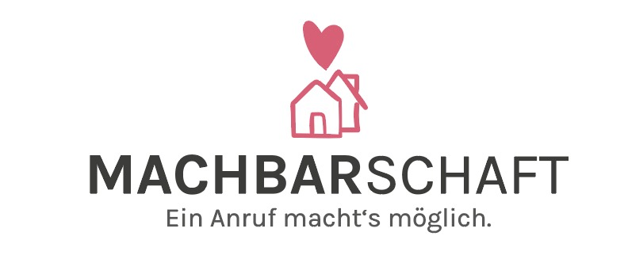

# Machbarschaft Dashboard

Project Machbarschaft was created in the context of [WirVsVirus Hackathon](https://wirvsvirushackathon.org/) hosted by the German Government. Our pitch video can be found [on youtube](https://www.youtube.com/watch?v=8YJ0I0dMmWg). We also have a [Devpost Profile](https://devpost.com/software/einanrufhilft) and a website [machbarschaft.jetzt](https://machbarschaft.jetzt/).

This repository contains the Admin Dashboard which is meant for the helper, to create new help seekings and manage them. 

## Angular project for Machbarschaft 

This project was generated with [Angular CLI](https://github.com/angular/angular-cli) version 9.1.7.

### Development server

Start admin-dashboard 

`npm run start:dashboard`

Build admin-dashboard 

`npm run build:dashboard:production`

Start lite-server for admin-dashboard project (located at dist/admin-dashboard)

`npm run liteserver:dashboard`

Build style-lib
 
`npm run build:style`

Firebase deployment

`npm run firebase:deploy:dashboard`

Note: before firebase deployment files from build have to be copied to directory public in root. If this directory is not existing, you have to create it with

`mkdir public`

Windows:

`xcopy dist\admin-dashboard\** public\ /s /e /Y`

Linux:

`cp dist/admin-dashboard/** public -r`

Further information will be added soon

### Project structure

<table>
  <thead>
    <tr>
      <th>
        project
      </th>
      <th>
        path
      </th>
    </tr>
  </thead>
  <tbody>
    <tr>
      <td>
        default angular project
      </td>
      <td>
        src
      </td>
    </tr>
    <tr>
      <td>
        admin-dashboard
      </td>
      <td>
        projects/admin-dashboard
      </td>
    </tr>
    <tr>
      <td>
        style lib and component library
      </td>
      <td>
        projects/style-lib
      </td>
    </tr>
  </tbody>
</table>

made with ❤ by us (machbarschaft).
